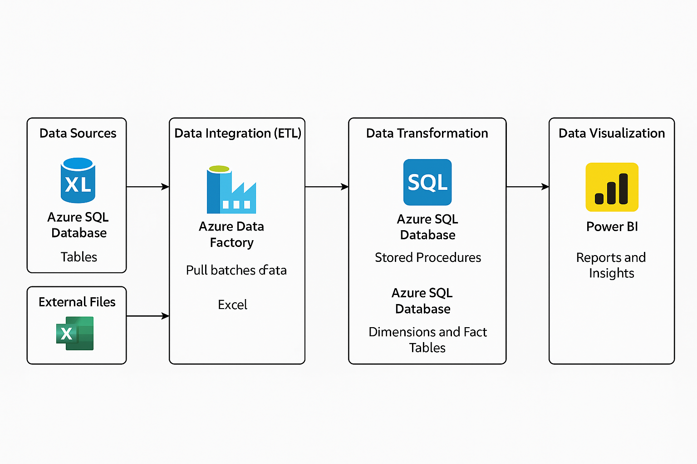
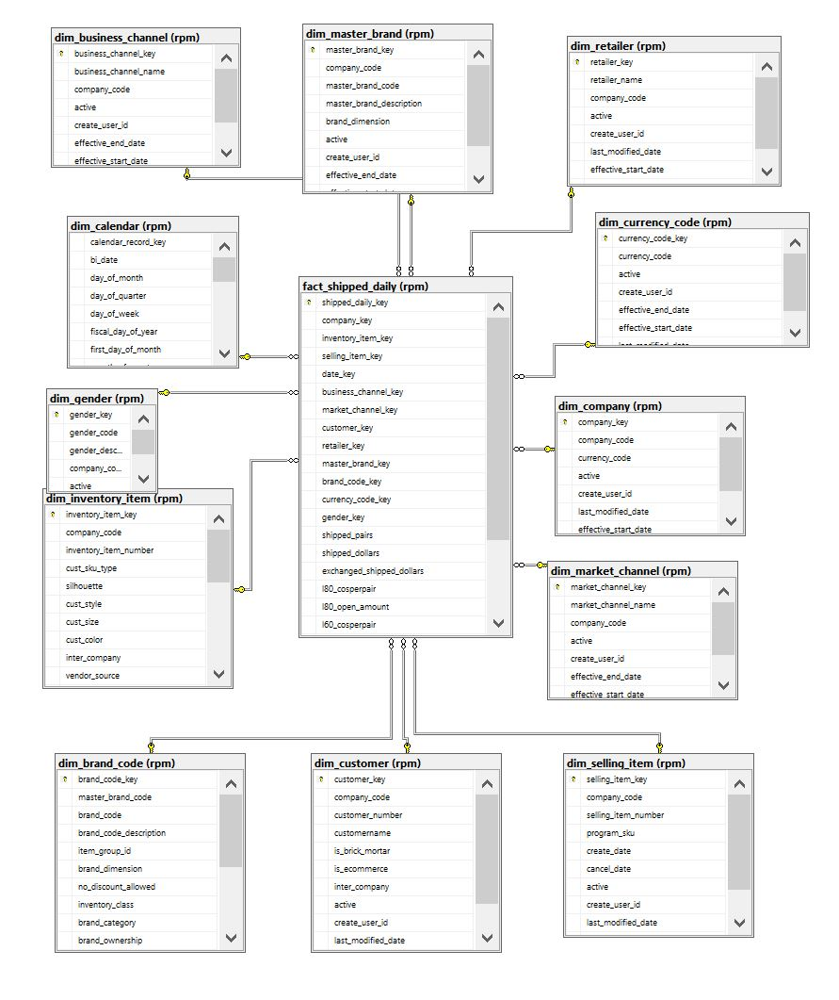
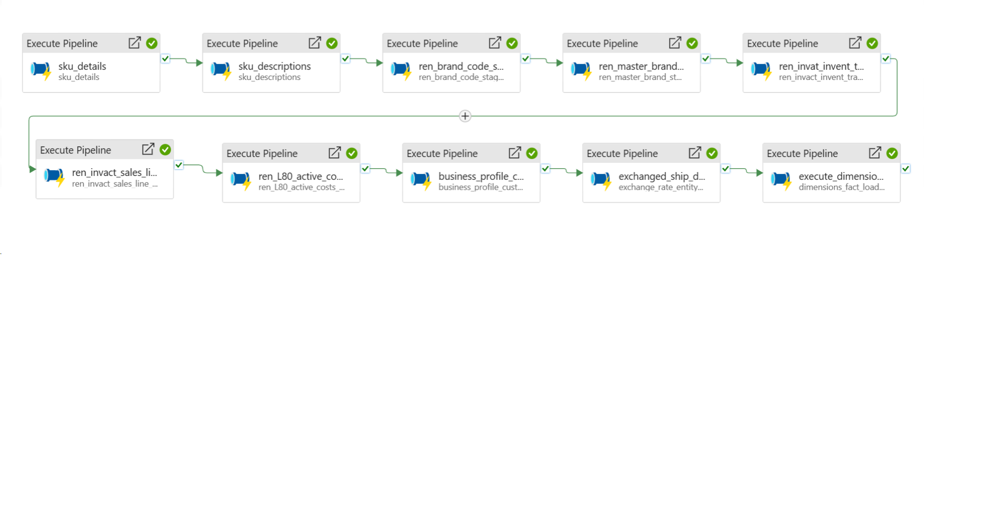
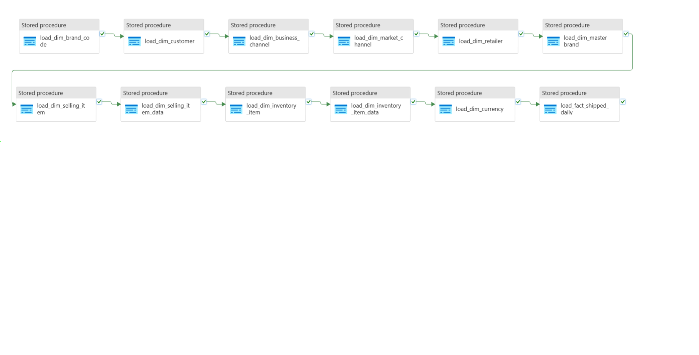
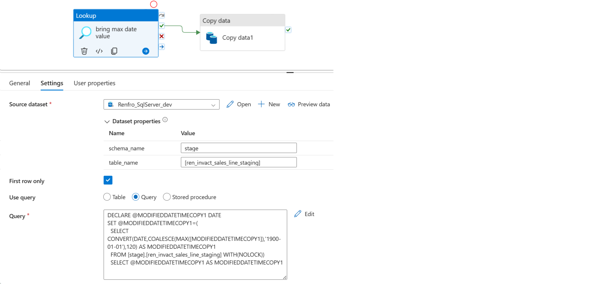
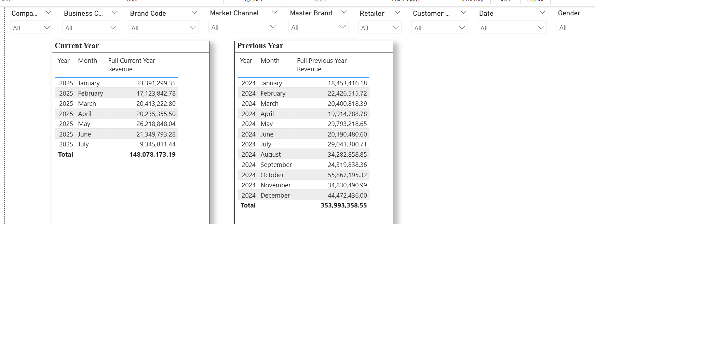
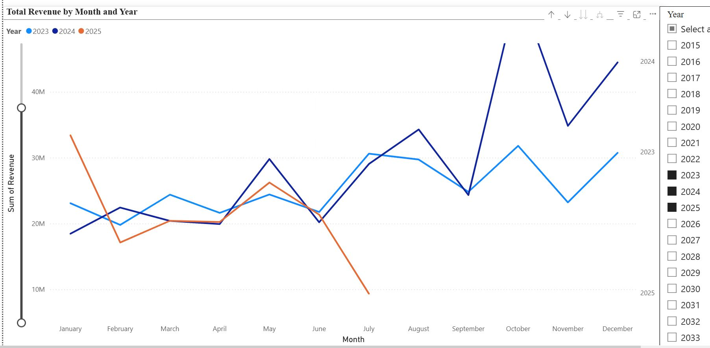
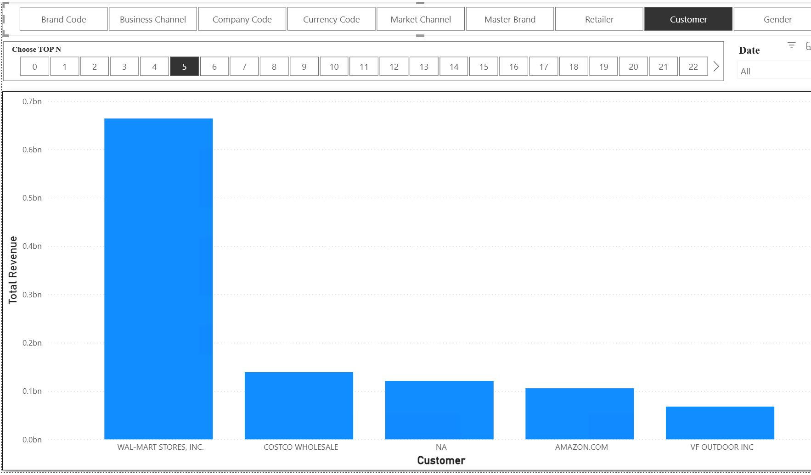

# 🛒 E-commerce Data Pipeline with Azure Data Factory, SQL Server & Power BI

## 📌 Overview
This project showcases a real-time data pipeline built for an e-commerce system using:
- **Azure Data Factory (ADF)** for ETL
- **Azure SQL Server** for data transformation and storage
- **Power BI** for insightful data visualization

## 🧱 Architecture

- Data Sources: Azure SQL Database & External Excel files
- ETL Tool: Azure Data Factory
- Transformation: SQL stored procedures using joins, CTEs, window functions, and MERGE
- Reporting: Power BI
## 🗃️ Data Model (Star Schema)

Fact Table:
- `fact_shipped_daily`
Dimension Tables:
- `dim_brand_code`, `dim_business_channel`, `dim_calendar`, `dim_company`, `dim_currency_code`, `dim_customer`, `dim_gender`, `dim_inventory_item`, `dim_market_channel`, `dim_master_brand`, `dim_retailer`, `dim_selling_item`
## 🔁 Data Pipelines
### Master Control Pipeline

### Dimensions and Fact Loading

### Incremental Loading Logic

### 🛠️ ETL Logic and Transformations
Key SQL Features Used:
Stored Procedures for each dimension and fact
Joins, CTEs, Window Functions (ROW_NUMBER, RANK, etc.)
Incremental logic using MAX(modified_date)
MERGE for SCD Type 2 handling
### 📊 Power BI Reports
Reports Showcase
You can explore the .pbix report:
📁 Renfro_data_dev_reports_AI_22052025_copy.pbix
Sample Insights:
📈 Top Selling Items by Volume & Revenue
🌍 Sales by Region/Market Channel
⏱️ Shipping Trends over Time
🧍‍♂️ Customer Segmentation by Gender and E-commerce Behavior

Sample Reports:




### 🚀 Technologies Used

| Tool/Tech          | Purpose                              |
| ------------------ | ------------------------------------ |
| Azure SQL Database | Data storage & transformation        |
| Azure Data Factory | ETL and data pipeline orchestration  |
| Power BI           | Reporting and dashboards             |
| SQL                | Data manipulation, cleaning, merging |
| GitHub             | Version control & portfolio          |

SQL Snippet:
```sql
DECLARE @MODIFIEDDATETIMECOPY1 DATE
SET @MODIFIEDDATETIMECOPY1 = (
  SELECT CONVERT(DATE, COALESCE(MAX(MODIFIEDDATETIMECOPY1), '1900-01-01'), 120)
  FROM [stage].[ren_invact_sales_line_staging] WITH(NOLOCK)
)
SELECT @MODIFIEDDATETIMECOPY1 AS MODIFIEDDATETIMECOPY1

